# Mybatis-Plus技术分享

## 分享介绍

1. 了解Mybatis-Plus
2. 整合Mybatis-Plus 
3. 通用CRUD 
4. 条件构造器
5. Mybatis-Plus的配置 
6. SQL注入原理
7. Sql 注入器实现自定义全局操作 
8. ActiveRecord 
9. 代码生成器
10. 执行分析插件
11. 性能分析插件

---

1. 逻辑删除 
2. 乐观锁
3. 通用枚举


mybatis 是一款优秀的持久层框架，它支持定制化 SQL、存储过程以及高级映射。 

但mybatis有个比较头疼的一个问题是sql工作量很大，尤其是字段多的时候。虽然说单表的增删改查操作可以通过mybatis generator工具来生成，但项目开发的过程中总免不了要新添加新字段，这些工具就帮不了了，得把新字段写到原来的所有增删改查的sql中。这是个痛苦的过程，特别是重复了很多次之后。

mybatis的单表操作也是贼麻烦的事，因为筛选的条件可能会各种各样，所以不得不写很多动态sql来兼容查询条件，不能集中精力去处理业务。


## 1、了解Mybatis-Plus

### 1.1、Mybatis-Plus介绍

MyBatis-Plus（简称 MP）是一个 MyBatis 的增强工具，在 MyBatis 的基础上只做增强不做改变，为简化开发、提高效率而生。

官网：https://mybatis.plus/ 或 https://mp.baomidou.com/


### 1.2、代码以及文档

文档地址：https://mybatis.plus/guide/ 

源码地址：https://github.com/baomidou/mybatis-plus 


### 1.3、特性

- **无侵入**：只做增强不做改变，引入它不会对现有工程产生影响，如丝般顺滑
- **损耗小**：启动即会自动注入基本 CURD，性能基本无损耗，直接面向对象操作
- **强大的 CRUD 操作**：内置通用 Mapper、通用 Service，仅仅通过少量配置即可实现单表大部分 CRUD 操作，更有强大的条件构造器，满足各类使用需求
- **支持 Lambda 形式调用**：通过 Lambda 表达式，方便的编写各类查询条件，无需再担心字段写错
- **支持主键自动生成**：支持多达 4 种主键策略（内含分布式唯一 ID 生成器 - Sequence），可自由配置，完美解决主键问题
- **支持 ActiveRecord 模式**：支持 ActiveRecord 形式调用，实体类只需继承 Model 类即可进行强大的 CRUD 操作
- **支持自定义全局通用操作**：支持全局通用方法注入（ Write once, use anywhere ）
- **内置代码生成器**：采用代码或者 Maven 插件可快速生成 Mapper 、 Model 、 Service 、 Controller 层代码，支持模板引擎，更有超多自定义配置等您来使用
- **内置分页插件**：基于 MyBatis 物理分页，开发者无需关心具体操作，配置好插件之后，写分页等同于普通 List 查询
- **分页插件支持多种数据库**：支持 MySQL、MariaDB、Oracle、DB2、H2、HSQL、SQLite、Postgre、SQLServer 等多种数据库
- **内置性能分析插件**：可输出 Sql 语句以及其执行时间，建议开发测试时启用该功能，能快速揪出慢查询
- **内置全局拦截插件**：提供全表 delete 、 update 操作智能分析阻断，也可自定义拦截规则，预防误操作


## 2、快速开始

对于Mybatis整合MP有常常有三种用法，分别是Mybatis+MP、Spring+Mybatis+MP、Spring Boot+Mybatis+MP。 

### 2.1、创建数据库以及表

```mysql
-- 创建测试表 
CREATE TABLE `tb_user` ( 
    `id` bigint(20) NOT NULL AUTO_INCREMENT COMMENT '主键ID', 
    `user_name` varchar(20) NOT NULL COMMENT '用户名', 
    `password` varchar(20) NOT NULL COMMENT '密码', 
    `name` varchar(30) DEFAULT NULL COMMENT '姓名', 
    `age` int(11) DEFAULT NULL COMMENT '年龄', 
    `email` varchar(50) DEFAULT NULL COMMENT '邮箱', 
    PRIMARY KEY (`id`) 
) ENGINE=InnoDB AUTO_INCREMENT=1 DEFAULT CHARSET=utf8; 

-- 插入测试数据 
INSERT INTO `tb_user` (`id`, `user_name`, `password`, `name`, `age`, `email`) VALUES ('1', 'zhangsan', '123456', '张三', '18', 'test1@qq.cn'); 
INSERT INTO `tb_user` (`id`, `user_name`, `password`, `name`, `age`, `email`) VALUES ('2', 'lisi', '123456', '李四', '20', 'test2@qq.cn'); 
INSERT INTO `tb_user` (`id`, `user_name`, `password`, `name`, `age`, `email`) VALUES ('3', 'wangwu', '123456', '王五', '28', 'test3@qq.cn'); 
INSERT INTO `tb_user` (`id`, `user_name`, `password`, `name`, `age`, `email`) VALUES ('4', 'zhaoliu', '123456', '赵六', '21', 'test4@qq.cn'); 
INSERT INTO `tb_user` (`id`, `user_name`, `password`, `name`, `age`, `email`) VALUES ('5', 'sunqi', '123456', '孙七', '24', 'test5@qq.cn');
```

### 2.2、创建工程

#### 2.2.1、Spring+Mybatis

##### 2.2.1.1、创建工程

##### 2.2.1.2、导入依赖

```xml
 <dependencies>
        <!-- <dependency>
            <groupId>org.mybatis</groupId>
            <artifactId>mybatis</artifactId>
            <version>3.4.6</version>
        </dependency>
        <dependency>
            <groupId>org.mybatis</groupId>
            <artifactId>mybatis-spring</artifactId>
            <version>2.0.1</version>
        </dependency>-->

        <!-- mybatis-plus插件依赖 -->
       <dependency>
            <groupId>com.baomidou</groupId>
            <artifactId>mybatis-plus</artifactId>
            <version>3.1.1</version>
        </dependency>

        <!-- MySql -->
        <dependency>
            <groupId>mysql</groupId>
            <artifactId>mysql-connector-java</artifactId>
            <version>5.1.47</version>
        </dependency>
        <!-- 连接池 -->
        <dependency>
            <groupId>com.alibaba</groupId>
            <artifactId>druid</artifactId>
            <version>1.0.11</version>
        </dependency>
        <!--简化bean代码的工具包-->
        <dependency>
            <groupId>org.projectlombok</groupId>
            <artifactId>lombok</artifactId>
            <optional>true</optional>
            <version>1.18.4</version>
        </dependency>

        <!--引入Spring框架，数据源-->
        <dependency>
            <groupId>org.springframework</groupId>
            <artifactId>spring-webmvc</artifactId>
            <version>5.1.6.RELEASE</version>
        </dependency>
        <dependency>
            <groupId>org.springframework</groupId>
            <artifactId>spring-jdbc</artifactId>
            <version>5.1.6.RELEASE</version>
        </dependency>
        <dependency>
            <groupId>org.springframework</groupId>
            <artifactId>spring-test</artifactId>
            <version>5.1.6.RELEASE</version>
        </dependency>

        <dependency>
            <groupId>junit</groupId>
            <artifactId>junit</artifactId>
            <version>4.12</version>
        </dependency>
        <dependency>
            <groupId>org.slf4j</groupId>
            <artifactId>slf4j-log4j12</artifactId>
            <version>1.6.4</version>
        </dependency>

    </dependencies>
```

##### 2.2.1.3、编写 log4j.properties

```properties
log4j.rootLogger=DEBUG,A1

log4j.appender.A1=org.apache.log4j.ConsoleAppender
log4j.appender.A1.layout=org.apache.log4j.PatternLayout
log4j.appender.A1.layout.ConversionPattern=[%t] [%c]-[%p] %m%n
```

##### 2.2.1.4、编写jdbc.properties

```properties
jdbc.driver=com.mysql.jdbc.Driver
jdbc.url=jdbc:mysql://112.124.25.228:3306/mp?useUnicode=true&characterEncoding=utf8&autoReconnect=true&allowMultiQueries=true&useSSL=false
jdbc.username=root
jdbc.password=916096467@Zxc
```

##### 2.2.1.5、编写applicationContext.xml

```xml
<?xml version="1.0" encoding="UTF-8"?>
<beans xmlns="http://www.springframework.org/schema/beans" xmlns:xsi="http://www.w3.org/2001/XMLSchema-instance"
       xmlns:context="http://www.springframework.org/schema/context"
       xsi:schemaLocation="http://www.springframework.org/schema/beans http://www.springframework.org/schema/beans/spring-beans.xsd http://www.springframework.org/schema/context http://www.springframework.org/schema/context/spring-context.xsd">
    <context:property-placeholder location="classpath:*.properties"/>

    <!-- 定义数据源 -->
    <bean id="dataSource" class="com.alibaba.druid.pool.DruidDataSource" destroy-method="close">
        <property name="url" value="${jdbc.url}"/>
        <property name="username" value="${jdbc.username}"/>
        <property name="password" value="${jdbc.password}"/>
        <property name="driverClassName" value="${jdbc.driver}"/>
        <property name="maxActive" value="10"/>
        <property name="minIdle" value="5"/>
    </bean>

     <!--这里使用MP提供的sqlSessionFactory，完成了Spring与MP的整合-->
    <!--mybatis使用的是 org.mybatis.spring.SqlSessionFactoryBean -->
    <!--mp使用的是 com.baomidou.mybatisplus.extension.spring.MybatisSqlSessionFactoryBean -->
    <bean id="sqlSessionFactory" class="com.baomidou.mybatisplus.extension.spring.MybatisSqlSessionFactoryBean">
        <property name="dataSource" ref="dataSource"/>
        <!--指定扫描的xml文件地址-->
        <property name="mapperLocations" value="classpath:mapper/*Mapper.xml"/>
    </bean>

    <!--扫描mapper接口，使用的依然是Mybatis原生的扫描器-->
    <bean class="org.mybatis.spring.mapper.MapperScannerConfigurer">
        <property name="basePackage" value="com.zr.mapper"/>

    </bean>
</beans>
```

##### 2.2.1.6、准备实体类

```java
package com.zr.entity;

import lombok.AllArgsConstructor;
import lombok.Data;
import lombok.NoArgsConstructor;

@Data
@NoArgsConstructor
@AllArgsConstructor
public class User {
    private Long id;
    private String userName;
    private String password;
    private String name;
    private Integer age;
    private String email;
}
```

##### 2.2.1.7、准备接口

```java
package com.zr.mapper;
import com.zr.entity.User;

public interface UserMapper{
    List<User> findAll();
}
```

##### 2.2.1.8、准备xml映射文件

```xml
<?xml version="1.0" encoding="UTF-8" ?> <!DOCTYPE mapper PUBLIC "-//mybatis.org//DTD Mapper 3.0//EN"
        "http://mybatis.org/dtd/mybatis-3-mapper.dtd">
<mapper namespace="com.zr.mapper.UserMapper">
    <select id="findAll" resultType="com.zr.entity.User">
        select * from tb_user
    </select>
</mapper>
```

##### 2.2.1.9、测试

```java
@RunWith(SpringJUnit4ClassRunner.class)
@ContextConfiguration(locations = "classpath:applicationContext.xml")
public class TestMp {

    @Autowired
    private UserMapper userMapper;

    @Test
    public void test(){
        List<User> all = userMapper.findAll();
        all.forEach(System.out::println);
    }
}
结果：
User(id=1, userName=zhangsan, password=123456, name=张三, age=21, email=test1@qq.com)
User(id=2, userName=lisi, password=123456, name=李四, age=20, email=test2@qq.com)
User(id=3, userName=wangwu, password=123456, name=王五, age=28, email=test32@qq.com)
User(id=4, userName=zhaoliu, password=123456, name=赵六, age=21, email=test4@qq.com)
User(id=5, userName=sunqi, password=123456, name=孙七, age=24, email=test5@qq.com)   
```

以上是spring + MyBatis 的基本操作

唯一不同的是使用的mp提供的MybatisSqlSessionFactoryBean

com.baomidou.mybatisplus.extension.spring.MybatisSqlSessionFactoryBean

如果原来使用的是原生的Mybatis，那么只需要换一个依赖包，然后在配置文件中把这个类替换掉，不用改任何代码，就可以无缝衔接到mp，就是这般丝滑。


#### 2.2.2、Spring+Mybatis+MP

##### 2.2.2.1、改造Mapper.java文件

将UserMapper继承BaseMapper，将拥有了BaseMapper中的所有方法：

```java
import com.baomidou.mybatisplus.core.mapper.BaseMapper;
import com.zr.entity.User;
import java.util.List;

public interface UserMapper extends BaseMapper<User> {
    List<User> findAll();
}
```

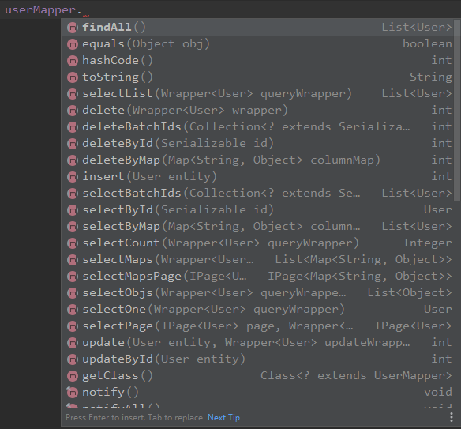

##### 2.2.22、编写测试用例

```java
@Test
    public void test2(){
        List<User> list = userMapper.selectList(null);
        list.forEach(System.out::println);
    }
```

结果：

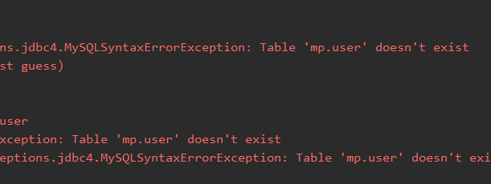

原因：如果数据库名和实体类没有严格按照驼峰命名，mp不知道使用的是哪一张表。

解决：在User对象中添加@TableName，指定数据库表名

```java
@Data
@NoArgsConstructor
@AllArgsConstructor
@TableName("tb_user")  //加这个注解，指定表名
public class User {
    private Long id;
    private String userName;
    private String password;
    private String name;
    private Integer age;
    private String email;

}
```

再次运行，运行成功，结果与上面一样。

##### 2.2.23、简单说明

由于使用了MybatisSqlSessionFactoryBuilder进行了构建，继承的BaseMapper中的方法就载入到了SqlSession中，所以就可以直接使用相关的方法；

如图：

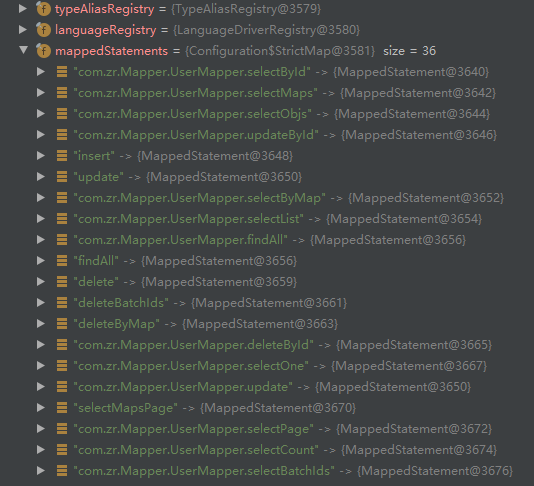


#### 2.2.3、SpringBoot+Mybatis+MP

##### 2.2.3.1、创建springBoot工程

##### 2.2.3.2、导入依赖

```xml
<dependencies>
        <!--mybatis-plus的springboot支持，这里面已经集成了spring-mybatis的依赖包-->
        <dependency>
            <groupId>com.baomidou</groupId>
            <artifactId>mybatis-plus-boot-starter</artifactId>
            <version>3.1.1</version>
        </dependency>

        <!--mysql驱动-->
        <dependency>
            <groupId>mysql</groupId>
            <artifactId>mysql-connector-java</artifactId>
            <version>5.1.47</version>
        </dependency>

        <dependency>
            <groupId>org.springframework.boot</groupId>
            <artifactId>spring-boot-starter</artifactId>
            <exclusions>
                <exclusion>
                    <groupId>org.springframework.boot</groupId>
                    <artifactId>spring-boot-starter-logging</artifactId>
                </exclusion>
            </exclusions>
        </dependency>

        <dependency>
            <groupId>org.projectlombok</groupId>
            <artifactId>lombok</artifactId>
            <optional>true</optional>
        </dependency>

        <dependency>
            <groupId>org.springframework.boot</groupId>
            <artifactId>spring-boot-starter-test</artifactId>
            <scope>test</scope>
        </dependency>

        <dependency>
            <groupId>org.slf4j</groupId>
            <artifactId>slf4j-log4j12</artifactId>
        </dependency>

    </dependencies>
```

##### 2.2.3.3、编写application.properties

```properties
spring.datasource.driver-class-name=com.mysql.jdbc.Driver
spring.datasource.url=jdbc:mysql://112.124.25.228:3306/mp?useUnicode=true&characterEncoding=utf8&autoReconnect=true&allowMultiQueries=true&useSSL=false
spring.datasource.username=root
spring.datasource.password=916096467@Zxc

# MP 配置文件
mybatis-plus.mapper-locations=classpath:mapper/*.xml
mybatis-plus.configuration.log-impl=org.apache.ibatis.logging.stdout.StdOutImpl
```

##### 2.2.3.4、准备实体类

```java
import com.baomidou.mybatisplus.annotation.TableName;
import lombok.AllArgsConstructor;
import lombok.Data;
import lombok.NoArgsConstructor;

@Data
@NoArgsConstructor
@AllArgsConstructor
@TableName("tb_user")
public class User {
    private Long id;
    private String userName;
    private String password;
    private String name;
    private Integer age;
    private String email;
}
```

##### 2.2.3.5、准备mapper接口

```java
public interface UserMapper extends BaseMapper<User> {

}
```

##### 2.2.3.6、在启动类上加扫描mapper包

```java
import org.mybatis.spring.annotation.MapperScan;
import org.springframework.boot.SpringApplication;
import org.springframework.boot.autoconfigure.SpringBootApplication;

@SpringBootApplication
@MapperScan("com.testmp.demo.mapper")  //指定扫描的mapper包
public class DemoApplication {

    public static void main(String[] args) {
        SpringApplication.run(DemoApplication.class, args);
    }

}
```

##### 2.2.3.7、编写测试用例

```java
@Autowired
UserMapper userMapper;

@Test
public void test(){
    List<User> users = userMapper.selectList(null);
    users.forEach(System.out::println);
}

结果：
User(id=1, userName=zhangsan, password=123456, name=张三, age=21, email=test1@qq.com)
User(id=2, userName=lisi, password=123456, name=李四, age=20, email=test2@qq.com)
User(id=3, userName=wangwu, password=123456, name=王五, age=28, email=test32@qq.com)
User(id=4, userName=zhaoliu, password=123456, name=赵六, age=21, email=test4@qq.com)
User(id=5, userName=sunqi, password=123456, name=孙七, age=24, email=test5@qq.com)
    
```


## 3、通用CRUD

通过继承BaseMapper就可以获取到各种各样的单表操作

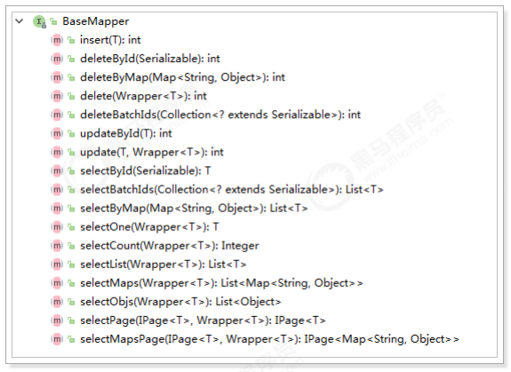

### 3.1、插入

#### 3.1.1、方法定义

```java
	/**
     * 插入一条记录
     *
     * @param entity 实体对象
     */
    int insert(T entity);
```

#### 3.1.2、测试用例

```java
@Test
public void testInsert() {
    User user = new User();
    user.setAge(20);
    user.setEmail("testxy@qq.cn");
    user.setName("小袁");
    user.setUserName("xiaoyuan");
    user.setPassword("123456");
    int result = this.userMapper.insert(user); //返回的result是受影响的行数，并不是自增 后的id
    System.out.println("result = " + result);
    System.out.println("自增后的id会回填到对象中:"+user.getId());
}
```

结果：

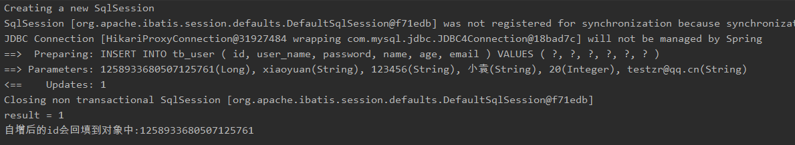

数据已经写入到了数据库，但是，id的值不正确，我们期望的是数据库自增长，实际是MP生成了id的值写入到了数据库。

解决办法：设置id的生成策略

#### 3.1.3、@TableId

MP支持的id策略：

```java
package com.baomidou.mybatisplus.annotation;

import lombok.Getter;

/**
 * 生成ID类型枚举类
 *
 * @author hubin
 * @since 2015-11-10
 */
@Getter
public enum IdType {
    /**
     * 数据库ID自增
     */
    AUTO(0),
    /**
     * 该类型为未设置主键类型
     */
    NONE(1),
    /**
     * 用户输入ID
     * <p>该类型可以通过自己注册自动填充插件进行填充</p>
     */
    INPUT(2),

    /* 以下3种类型、只有当插入对象ID 为空，才自动填充。 */
    /**
     * 全局唯一ID (idWorker)
     */
    ID_WORKER(3),
    /**
     * 全局唯一ID (UUID)
     */
    UUID(4),
    /**
     * 字符串全局唯一ID (idWorker 的字符串表示)
     */
    ID_WORKER_STR(5);

    private final int key;

    IdType(int key) {
        this.key = key;
    }
}

```

修改User对象： 指定id类型为自增长

```java
@Data
@NoArgsConstructor
@AllArgsConstructor
@TableName("tb_user")
public class User {
    
    @TableId(type = IdType.AUTO) //指定id类型为自增长
    private Long id;
    private String userName;
    private String password;
    private String name;
    private Integer age;
    private String email;
}
```

注意，由于刚才自增id已经被MP刷到了很大的值，这里要将原来的数据删掉，修改mysql的自增策略，就是把auto Incr 取消勾选，保存，之后再次勾选保存。

或者使用`ALTER TABLE `tb_user` AUTO_INCREMENT=5;重 置主键自增

修改后再次执行插入操作，执行成功

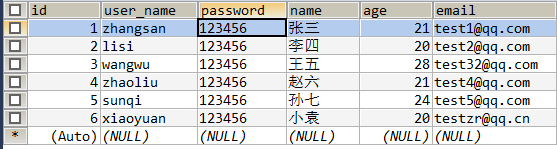

#### 3.1.4、**@TableField** 

在MP中通过@TableField注解可以指定字段的一些属性，常常解决的问题有3个：

1. 对象中的属性名和字段名不一致的问题（非驼峰），如果是标准驼峰他会自动映射
2. 对象中的属性字段在表中不存在的问题
3. 不需要查询的字段，比如密码等隐私信息。

使用：

```java
@Data
@NoArgsConstructor
@AllArgsConstructor
@TableName("tb_user")
public class User {

    @TableId(type = IdType.AUTO) //指定id类型为自增长
    private Long id;
    private String userName;
    
    @TableField(select = false)     //查询的时候，不查该字段
    private String password;
    private String name;
    private Integer age;

    @TableField(value = "email")    //解决字段名不一致
    private String mail;

    @TableField(exist = false)    //该字段在数据库表中不存在
    private String address;

}
```

测试：

```java
@Test
public void testInsert() {
    User user = new User();
    user.setAge(20);
    user.setMail("testxy@qq.cn");	//这个字段数据库叫email	
    user.setName("小袁1");
    user.setUserName("xiaoyuan1");
    user.setPassword("1234561");
    user.setAddress("vivo大厦");    	//这个字段数据库没有
    int result = this.userMapper.insert(user); 
    System.out.println("result = " + result);
    System.out.println("自增后的id会回填到对象中:"+user.getId());
}
```

结果：

还是使用的email这个字段插入，并且没有将address这个字段插入

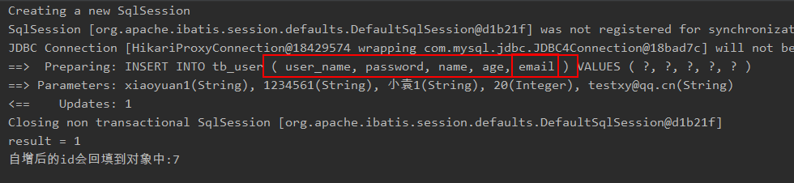


执行查询语句：

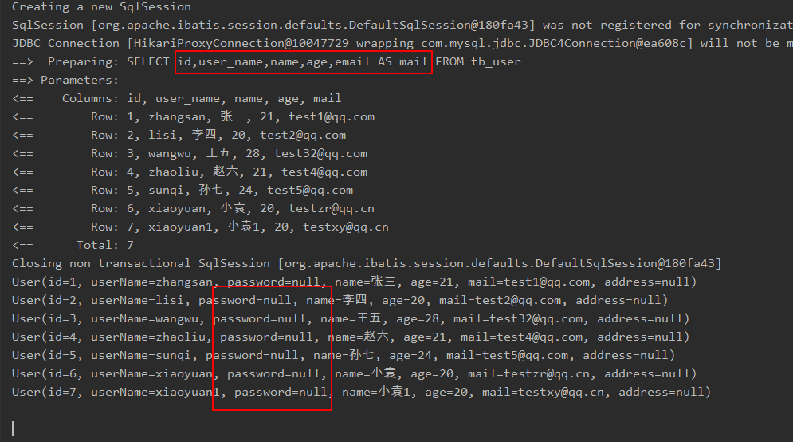


### 3.2、更新

#### 3.2.1、根据id更新

方法定义：

```java
/**
 * 根据 ID 修改
 *
 * @param entity 实体对象
 */
int updateById(@Param(Constants.ENTITY) T entity);
```

测试：

```java
@Test
public void testUpdateById(){
    User user = new User();
    user.setId(1L);          //主键
    user.setName("小红");     //需要更新的字段

    userMapper.updateById(user);
}
```

结果：

```
==>  Preparing: UPDATE tb_user SET name=? WHERE id=? 
==> Parameters: 小红(String), 1(Long)
<==    Updates: 1
```


#### 3.2.2、根据条件更新

方法定义：

```java
/**
     * 根据 whereEntity 条件，更新记录
     *
     * @param entity        实体对象 (set 条件值,可以为 null)
     * @param updateWrapper 实体对象封装操作类（可以为 null,里面的 entity 用于生成 where 语句）
     */
    int update(@Param(Constants.ENTITY) T entity, 
               @Param(Constants.WRAPPER) Wrapper<T> updateWrapper);
```

测试：

```java
//使用QueryWrapper （常用）
@Test
public void testUpdate(){
    User user = new User();
    user.setName("小明");         //需要更新的字段
    user.setPassword("456456");  //需要更新的字段

    //构建查询条件
    QueryWrapper<User> wrapper = new QueryWrapper<>();
    wrapper.eq("user_name","lisi"); //匹配user_name = "zhansgan" 的用户数据

    userMapper.update(user,wrapper);
}

//注意，这里eq的第一个字段是数据库的字段名，而不是实体类中的字段名
```

结果：

```
==>  Preparing: UPDATE tb_user SET password=?, name=? WHERE user_name = ? 
==> Parameters: 456456(String), 小明(String), lisi(String)
<==    Updates: 1
```


或者，通过UpdateWrapper进行更新： 

```java
//使用UpdateWrapper  （用的比较少）
@Test
public void testUpdate2(){

    UpdateWrapper<User> wrapper = new UpdateWrapper<>();
    wrapper.set("user_name","小刚")
        .set("age",10)
        .eq("id",3);

    userMapper.update(null,wrapper);
}

结果：
==>  Preparing: UPDATE tb_user SET user_name=?,age=? WHERE id = ? 
==> Parameters: 小刚(String), 10(Integer), 3(Integer)
<==    Updates: 1
```

均可达到更新的效果。


### 3.3、删除

#### 3.3.1、deleteById

方法定义： 

```java
/**
     * 根据 ID 删除
     *
     * @param id 主键ID
     */
int deleteById(Serializable id);
```

测试：

```java
@Test
public void testDeleteById() {
    userMapper.deleteById(6);
}
```

结果：

```
==>  Preparing: DELETE FROM tb_user WHERE id=? 
==> Parameters: 6(Integer)
<==    Updates: 1
```


#### 3.3.2、deleteByMap

方法定义

```java
    /**
     * 根据 columnMap 条件，删除记录
     *
     * @param columnMap 表字段 map 对象
     */
    int deleteByMap(@Param(Constants.COLUMN_MAP) Map<String, Object> columnMap);
```

测试：

```java
@Test
public void testDeleteByMap(){
    Map<String, Object> columnMap = new HashMap<>();
    columnMap.put("age",24);
    columnMap.put("name","孙七"); //将columnMap中的元素设置为删除的条件，多个之间为and关系

    userMapper.deleteByMap(columnMap);
}
```

结果：

```
==> Preparing: DELETE FROM tb_user WHERE name = ? AND age = ? 
==> Parameters: 孙七(String), 24(Integer)
<==    Updates: 1
```


#### 3.3.3、delete

方法定义

```java
    /**
     * 根据 entity 条件，删除记录
     *
     * @param wrapper 实体对象封装操作类（可以为 null）
     */
    int delete(@Param(Constants.WRAPPER) Wrapper<T> wrapper);
```

测试：

```java
@Test
public void testDelete(){
    User user = new User();
    user.setAge(21);
    user.setName("赵六"); //将实体对象进行包装，包装为操作条件

    QueryWrapper<User> wrapper = new QueryWrapper<>(user);
    userMapper.delete(wrapper);
}
```

这里直接将查询对象入参，和使用wrapper.eq() 效果是一样的


结果：

```
==>  Preparing: DELETE FROM tb_user WHERE name=? AND age=? 
==> Parameters: 赵六(String), 21(Integer)
<==    Updates: 1
```


#### 3.3.4、deleteBatchIds

方法定义

```java
    /**
     * 删除（根据ID 批量删除）
     *
     * @param idList 主键ID列表(不能为 null 以及 empty)
     */
    int deleteBatchIds(@Param(Constants.COLLECTION) Collection<? extends Serializable> idList);
```

测试：

```java
@Test
public void testDeleteBatchIds(){
    int result = userMapper.deleteBatchIds(Arrays.asList(3, 7, 10));
    System.out.println("result = " + result);
}
```

结果：

```
==>  Preparing: DELETE FROM tb_user WHERE id IN ( ? , ? , ? ) 
==> Parameters: 3(Integer), 7(Integer), 10(Integer)
<==    Updates: 2

result = 2
```

因为没有id为10的对象，所以只删除了两条数据


### 3.4、查询

MP提供了多种查询操作，包括根据id查询、批量查询、查询单条数据、查询列表、分页查询等操作。

#### 3.4.1、selectById

根据id查询数据 

```java
@Test
public void testSelectById() { 
    User user = userMapper.selectById(2L);
    System.out.println("result = " + user);
}
```

结果：

```
==>  Preparing: SELECT id,user_name,name,age,email AS mail FROM tb_user WHERE id=? 
==> Parameters: 2(Long)
<==    Columns: id, user_name, name, age, mail
<==        Row: 2, lisi, 小明, 20, test2@qq.com
<==      Total: 1

result = User(id=2, userName=lisi, password=null, name=小明, age=20, mail=test2@qq.com, address=null)
```


#### 3.4.2、selectBatchIds

查询（根据ID 批量查询）

```java
@Test
public void testSelectBatchIds() {
    userMapper.selectBatchIds(Arrays.asList(1, 2, 3,4, 10));
}
```

结果：

```
==>  Preparing: SELECT id,user_name,name,age,email AS mail FROM tb_user WHERE id IN ( ? , ? , ? , ? , ? ) 
==> Parameters: 1(Integer), 2(Integer), 3(Integer), 4(Integer), 10(Integer)
<==    Columns: id, user_name, name, age, mail
<==        Row: 1, zhangsan, 张三, 18, test1@qq.cn
<==        Row: 2, lisi, 李四, 20, test2@qq.cn
<==        Row: 3, wangwu, 王五, 28, test3@qq.cn
<==        Row: 4, zhaoliu, 赵六, 21, test4@qq.cn
<==      Total: 4
```


#### 3.4.3、selectOne

根据 entity 条件，查询一条记录 

```java
@Test
public void testSelectOne() {
    QueryWrapper<User> wrapper = new QueryWrapper<>();
    wrapper.eq("name", "李四");

    //根据条件查询一条数据，如果结果超过一条会报错
    User user = userMapper.selectOne(wrapper);
    System.out.println(user);
}
```

结果：

```
==>  Preparing: SELECT id,user_name,name,age,email AS mail FROM tb_user WHERE name = ? 
==> Parameters: 李四(String)
<==    Columns: id, user_name, name, age, mail
<==        Row: 2, lisi, 李四, 20, test2@qq.cn
<==      Total: 1

User(id=2, userName=lisi, password=null, name=李四, age=20, mail=test2@qq.cn, address=null)
```


#### 3.4.4、selectCount

根据 Wrapper 条件，查询总记录数

```java
@Test 
public void testSelectCount() { 
    QueryWrapper<User> wrapper = new QueryWrapper<>(); 
    wrapper.gt("age", 23); //年龄大于23岁
                                     
    //根据条件查询数据条数             
    Integer count = userMapper.selectCount(wrapper); 
    System.out.println("count = " + count); 
}
```

结果：

```
==>  Preparing: SELECT COUNT( 1 ) FROM tb_user WHERE age > ? 
==> Parameters: 23(Integer)
<==    Columns: COUNT( 1 )
<==        Row: 2
<==      Total: 1

count = 2
```


#### 3.4.5、selectList

根据 entity 条件，查询全部记录

@param queryWrapper 实体对象封装操作类（可以为 null）

```java
@Test
public void testSelectList2() {
    QueryWrapper<User> wrapper = new QueryWrapper<User>();
    wrapper.gt("age", 23); //年龄大于23岁
    //根据条件查询数据
    List<User> users = userMapper.selectList(wrapper);
    users.forEach(System.out::println);
}
```

结果：

```
==>  Preparing: SELECT id,user_name,name,age,email AS mail FROM tb_user WHERE age > ? 
==> Parameters: 23(Integer)
<==    Columns: id, user_name, name, age, mail
<==        Row: 3, wangwu, 王五, 28, test3@qq.cn
<==        Row: 5, sunqi, 孙七, 24, test5@qq.cn
<==      Total: 2

User(id=3, userName=wangwu, password=null, name=王五, age=28, mail=test3@qq.cn, address=null)
User(id=5, userName=sunqi, password=null, name=孙七, age=24, mail=test5@qq.cn, address=null)
```


#### 3.4.6、selectPage

根据 entity 条件，查询全部记录（并翻页） 

@param page 分页查询条件（可以为 RowBounds.DEFAULT） 

@param queryWrapper 实体对象封装操作类（可以为 null） 


配置分页插件： 

```java
@Configuration
@MapperScan("com.testmp.demo.mapper") //设置mapper接口的扫描包
public class MybatisPlusConfig {

    /**
     * 分页插件
     */
    @Bean
    public PaginationInterceptor paginationInterceptor() {
        return new PaginationInterceptor();
    }

}
```

测试：

```java
@Test
public void testSelectPage() {
    QueryWrapper<User> wrapper = new QueryWrapper<User>();
    wrapper.gt("age", 10);  //年龄大于10
    Page<User> page = new Page<>(1, 2);
    //根据条件查询数据
    IPage<User> iPage = userMapper.selectPage(page, wrapper);

    System.out.println("数据总条数：" + iPage.getTotal());
    System.out.println("总页数：" + iPage.getPages());

    List<User> users = iPage.getRecords();
    for (User user : users) {
        System.out.println("user = " + user);
    }
}
```

结果：

```
==>  Preparing: SELECT COUNT(1) FROM tb_user WHERE age > ? 
==> Parameters: 10(Integer)
<==    Columns: COUNT(1)
<==        Row: 5
==>  Preparing: SELECT id,user_name,name,age,email AS mail FROM tb_user WHERE age > ? LIMIT ?,? 
==> Parameters: 10(Integer), 0(Long), 2(Long)
<==    Columns: id, user_name, name, age, mail
<==        Row: 1, zhangsan, 张三, 18, test1@qq.cn
<==        Row: 2, lisi, 李四, 20, test2@qq.cn
<==      Total: 2
Closing non transactional SqlSession [org.apache.ibatis.session.defaults.DefaultSqlSession@1fae596]
数据总条数：5
总页数：3
```


## 4、条件构造器

官网文档地址：https://mybatis.plus/guide/wrapper.html 

### 4.1、allEq

- 只传一个参数，必须全都是相等的关系

```java
@Test
public void testAllEq(){

    Map<String, Object> map = new HashMap<>();
    map.put("age", 24);
    map.put("name", "孙七");
    map.put("email",null);

    QueryWrapper<User> wapper = new QueryWrapper<>();
    wapper.allEq(map);

    List<User> list = userMapper.selectList(wapper);
    list.forEach(System.out::println);

}

```

上面这个查询语句相当于这条sql语句

```mysql
==>  Preparing: 
     		SELECT id,user_name,name,age,email AS mail 
      		FROM tb_user 
			WHERE name = ? AND age = ? AND email IS NULL 
==> Parameters: 孙七(String), 24(Integer)
<==      Total: 0
```

没查到数据，因为`email IS NULL`的条件都不符合


- 传两个参数，如果为null，则不拼接条件

```java
@Test
public void testAllEq2(){

    Map<String, Object> map = new HashMap<>();
    map.put("age", 24);
    map.put("name", "孙七");
    map.put("email",null);

    QueryWrapper<User> wapper = new QueryWrapper<>();
    wapper.allEq(map,false);

    List<User> list = userMapper.selectList(wapper);
    list.forEach(System.out::println);

}
```

结果：

```mysql
==>  Preparing: 
				SELECT id,user_name,name,age,email AS mail 
				FROM tb_user 
				WHERE name = ? AND age = ? 
==> Parameters: 孙七(String), 24(Integer)
<==    Columns: id, user_name, name, age, mail
<==        Row: 5, sunqi, 孙七, 24, test5@qq.cn
<==      Total: 1
```


- 使用lambda表达式，来筛选需要匹配的参数

  k代表map的key值，如果k等于某一个参数，那么才会拼接条件，否则不拼接

```java
@Test
public void testAllEq3(){

    Map<String, Object> map = new HashMap<>();
    map.put("age", 24);
    map.put("name", "孙七");
    map.put("email",null);

    QueryWrapper<User> wapper = new QueryWrapper<>();
    wapper.allEq((k,v)->(k.equals("name")|| k.equals("age")),map);

    List<User> list = userMapper.selectList(wapper);
    list.forEach(System.out::println);

}
```

结果：

```mysql
==>  Preparing: 
				SELECT id,user_name,name,age,email AS mail 
				FROM tb_user 
				WHERE name = ? AND age = ? 
				
==> Parameters: 孙七(String), 24(Integer)
<==    Columns: id, user_name, name, age, mail
<==        Row: 5, sunqi, 孙七, 24, test5@qq.cn
<==      Total: 1
```


### 4.2、基本比较操作

| 方法       | 说明                                      |
| ---------- | ----------------------------------------- |
| eq         | 等于 =                                    |
| ne         | 不等于 <>                                 |
| gt         | 大于 >                                    |
| ge         | 大于等于 >=                               |
| lt         | 小于 <                                    |
| le         | 小于等于 <=                               |
| between    | BETWEEN 值1 AND 值2                       |
| notBetween | NOT BETWEEN 值1 AND 值2                   |
| in         | 字段 IN (value.get(0), value.get(1), ...) |
| notIn      | 字段 NOT IN (v0, v1, ...)                 |

测试：

```java
@Test
public void testEq(){
    QueryWrapper<User> wrapper = new QueryWrapper<>();
    wrapper.eq("password","123456")            //密码等于123456
           .ge("age", 21)                      //年龄大于等于21
           .in("name", "李四", "王五", "赵六");  //姓名在这三个人中

    List<User> users = userMapper.selectList(wrapper);
    users.forEach(System.out::println);

}
```

结果：

```mysql
==>  Preparing: 
				SELECT id,user_name,name,age,email AS mail 
				FROM tb_user 
				WHERE password = ? AND age >= ? AND name IN (?,?,?) 
==> Parameters: 123456(String), 21(Integer), 李四(String), 王五(String), 赵六(String)
<==    Columns: id, user_name, name, age, mail
<==        Row: 3, wangwu, 王五, 28, test3@qq.cn
<==        Row: 4, zhaoliu, 赵六, 21, test4@qq.cn
<==      Total: 2
```


### 4.3、模糊查询

| 方法      | 示例            | 说明                                                |
| --------- | --------------- | --------------------------------------------------- |
| like      | LIKE '%值%'     | 例: like("name", "王") ---> name like '%王%'        |
| notLike   | NOT LIKE '%值%' | 例: notLike("name", "王") ---> name not like '%王%' |
| likeLeft  | LIKE '%值'      | 例: likeLeft("name", "王") ---> name like '%王'     |
| likeRight | LIKE '值%'      | 例: likeRight("name", "王") ---> name like '王%'    |

测试：

```java
@Test
public void testLike(){

    QueryWrapper<User> wrapper = new QueryWrapper<>();
    wrapper.likeLeft("name","五");

    List<User> users = userMapper.selectList(wrapper);
    users.forEach(System.out::println);
}
```

结果：

```mysql
==>  Preparing: SELECT id,user_name,name,age,email AS mail FROM tb_user WHERE name LIKE ? 
==> Parameters: %五(String)
<==    Columns: id, user_name, name, age, mail
<==        Row: 3, wangwu, 王五, 28, test3@qq.cn
<==      Total: 1
```


### 4.4、排序

- orderBy 
  - 排序：ORDER BY 字段, ... 
  - 例: `orderBy(true, true, "id", "name") ---> order by id ASC,name ASC`
- orderByAsc 
  - 排序：ORDER BY 字段, ... ASC
  - 例: orderByAsc("id", "name") ---> order by id ASC,name ASC 
- orderByDesc 
  - 排序：ORDER BY 字段, ... DESC
  - 例: `orderByDesc("id", "name") ---> order by id DESC,name DESC`

默认的就是asc，orderBy 和 orderByAsc 效果是一样的

测试：

```java
@Test
public void testOrderByDesc(){
    QueryWrapper<User> wrapper = new QueryWrapper<>();
    wrapper.orderByDesc("age");

    List<User> users = userMapper.selectList(wrapper);
    users.forEach(System.out::println);
}
```

结果：

```mysql
==>  Preparing: SELECT id,user_name,name,age,email AS mail FROM tb_user ORDER BY age DESC 
==> Parameters: 
<==    Columns: id, user_name, name, age, mail
<==        Row: 3, wangwu, 王五, 28, test3@qq.cn
<==        Row: 5, sunqi, 孙七, 24, test5@qq.cn
<==        Row: 4, zhaoliu, 赵六, 21, test4@qq.cn
<==        Row: 2, lisi, 李四, 20, test2@qq.cn
<==        Row: 1, zhangsan, 张三, 18, test1@qq.cn
<==      Total: 5
```


### 4.5、逻辑查询

- or 
  - 拼接 OR 
  - 主动调用 or 表示紧接着下一个方法不是用 and 连接! (不调用 or 则默认为使用 and 连接) 
- and 
  - AND 嵌套 
  - 例: and(i -> i.eq("name", "李白").ne("status", "活着")) ---> and (name = '李白' and status <> '活着') 

测试：

```java
@Test
public void testEq(){
    QueryWrapper<User> wrapper = new QueryWrapper<>();
    wrapper.eq("name","王五")
           .eq("age",21);

    List<User> users = userMapper.selectList(wrapper);
    users.forEach(System.out::println);
}
```

结果：

```mysql
==>  Preparing: SELECT id,user_name,name,age,email AS mail 
				FROM tb_user 
				WHERE name = ? AND age = ? 
==> Parameters: 王五(String), 21(Integer)
<==      Total: 0
```


测试or：

```java
@Test
public void testOr(){
   QueryWrapper<User> wrapper = new QueryWrapper<>();
        wrapper.eq("name","王五")
                .or()
                .eq("age",21)
                .eq("email","test4@qq.cn")
                .or()
                .eq("name","张三");

    List<User> users = userMapper.selectList(wrapper);
    users.forEach(System.out::println);
}
```

结果：

```mysql
==>  Preparing: SELECT id,user_name,name AS realName,age,email FROM tb_user WHERE name = ? OR age = ? AND email = ? OR name = ? 
==> Parameters: 王五(String), 21(Integer), test4@qq.cn(String), 张三(String)
<==    Columns: id, user_name, realName, age, email
<==        Row: 1, zhangsan, 张三, 18, test1@qq.cn
<==        Row: 3, wangwu, 王五, 28, test3@qq.cn
<==        Row: 4, zhaoliu, 赵六, 21, test4@qq.cn
<==      Total: 3
```


### 4.6、select

在MP查询中，默认查询所有的字段，如果有需要也可以通过select方法进行指定字段。

测试：

```java
@Test
public void testSelect(){
    QueryWrapper<User> wrapper = new QueryWrapper<>();
    wrapper.eq("name","王五")
        .or()
        .eq("age",21)
        .select("name","age","email");

    List<User> users = userMapper.selectList(wrapper);
    users.forEach(System.out::println);
}
```

结果：

```mysql
==>  Preparing: SELECT name,age,email FROM tb_user WHERE name = ? OR age = ? 
==> Parameters: 王五(String), 21(Integer)
<==    Columns: name, age, email
<==        Row: 王五, 28, test3@qq.cn
<==        Row: 赵六, 21, test4@qq.cn
<==      Total: 2
```


## 5、配置

在MP中有大量的配置，其中有一部分是Mybatis原生的配置，另一部分是MP的配置，详情：https://mybatis.plus/confifig/ 

### 5.1、基本配置

#### 5.1.1、configLocation

MyBatis 配置文件位置，如果有单独的 MyBatis 配置，将其路径配置到 confifigLocation 中。 MyBatisConfifiguration 的具体内容请参考MyBatis 官方文档

Spring Boot：

```properties
mybatis-plus.config-location = classpath:mybatis-config.xml
```

Spring MVC：

```xml
<bean id="sqlSessionFactory"  class="com.baomidou.mybatisplus.extension.spring.MybatisSqlSessionFactoryBean">          <property name="configLocation" value="classpath:mybatis-config.xml"/> 
</bean>
```


#### 5.1.2、mapperLocations

MyBatis Mapper 所对应的 XML 文件位置，如果您在 Mapper 中有自定义方法（XML 中有自定义实现），需要进行该配置，告诉 Mapper 所对应的 XML 文件位置。 

Spring Boot： 

```properties
mybatis-plus.mapper-locations = classpath*:mybatis/*.xml
```

Spring MVC：

```xml
<bean id="sqlSessionFactory"
      class="com.baomidou.mybatisplus.extension.spring.MybatisSqlSessionFactoryBean">
    <property name="mapperLocations" value="classpath*:mybatis/*.xml"/>
</bean>
```

注意：Maven多模块项目的扫描路径需以 classpath*: 开头 （即加载多个 jar包下的XML 文件）


#### 5.1.3、typeAliasesPackage

MyBaits 别名包扫描路径，通过该属性可以给包中的类注册别名，注册后在 Mapper 对应的 XML 文件中可以直接使用类名，而不用使用全限定的类名（即 XML 中调用的时候不用包含包名）。 

Spring Boot： 

```properties
mybatis-plus.type-aliases-package = com.testmp.demo.entity
```

Spring MVC：

```xml
<bean id="sqlSessionFactory" class="com.baomidou.mybatisplus.extension.spring.MybatisSqlSessionFactoryBean"> 
    <property name="typeAliasesPackage" value="com.baomidou.mybatisplus.samples.quickstart.entity"/> 
</bean>
```


### 5.2、进阶配置

本部分（Configuration）的配置大都为 MyBatis 原生支持的配置，这意味着可以通过 MyBatis XML 配置文件的式进行配置。

#### 5.2.1、mapUnderscoreToCamelCase

- 类型： boolean
- 默认：true

```properties
#关闭自动驼峰映射，该参数不能和mybatis-plus.config-location同时存在
mybatis-plus.configuration.map-underscore-to-camel-case=false
```

注意：此属性在 MyBatis 中原默认值为 false，在 MyBatis-Plus 中，此属性也将用于生成最终的 SQL 的 select body如果您的数据库命名符合规则无需使用 @TableField 注解指定数据库字段名 


#### 5.2.2、cacheEnabled

- 类型： boolean 
- 默认值： true 

全局地开启或关闭配置文件中的所有映射器已经配置的任何缓存，默认为 true。

```properties
mybatis-plus.configuration.cache-enabled=false
```


### 5.3、DB 策略配置

#### 5.3.1、idType

- 类型： com.baomidou.mybatisplus.annotation.IdType 
- 默认值： ID_WORKER

全局默认主键类型，设置后，即可省略实体对象中的@TableId(type = IdType.AUTO)配置。


SpringBoot： 

```properties
mybatis-plus.global-config.db-config.id-type=auto
```

SpringMVC： 

```xml
<!--这里使用MP提供的sqlSessionFactory，完成了Spring与MP的整合--> 
<bean id="sqlSessionFactory" class="com.baomidou.mybatisplus.extension.spring.MybatisSqlSessionFactoryBean"> 
    <property name="dataSource" ref="dataSource"/> 
    <property name="globalConfig"> 
        <bean class="com.baomidou.mybatisplus.core.config.GlobalConfig"> 
            <property name="dbConfig"> 
               <bean class="com.baomidou.mybatisplus.core.config.GlobalConfig$DbConfig"> 
                   <property name="idType" value="AUTO"/> 
                </bean> 
            </property> 
        </bean> 
    </property> 
</bean>
```


#### 5.3.2、tablePrefix

- 类型： String
- 默认值： null

表名前缀，全局配置后可省略@TableName()配置。 

SpringBoot：

```properties
mybatis-plus.global-config.db-config.table-prefix=tb_
```

SpringMVC： 

```xml
<bean id="sqlSessionFactory" class="com.baomidou.mybatisplus.extension.spring.MybatisSqlSessionFactoryBean"> 
    <property name="dataSource" ref="dataSource"/> 
    <property name="globalConfig"> 
        <bean class="com.baomidou.mybatisplus.core.config.GlobalConfig"> 
            <property name="dbConfig"> 
                <bean class="com.baomidou.mybatisplus.core.config.GlobalConfig$DbConfig"> 
                    <property name="idType" value="AUTO"/> 
                    <property name="tablePrefix" value="tb_"/> 
                </bean> 
            </property> 
        </bean> 
    </property> 
</bean>
```


## 6、SQL注入的原理

MP在启动后会将BaseMapper中的一系列的方法注册到meppedStatements中，那么究竟是如何注入的呢？流程又是怎么样的？

在MP中，	负责SQL的注入工作，它是一个接口，AbstractSqlInjector是它的实现类，实现关系如下：


在AbstractSqlInjector中，主要是由inspectInject()方法进行注入的，如下：

```java
public abstract class AbstractSqlInjector implements ISqlInjector {

    private static final Log logger = LogFactory.getLog(AbstractSqlInjector.class);

    @Override
    public void inspectInject(MapperBuilderAssistant builderAssistant, Class<?> mapperClass) {
        Class<?> modelClass = extractModelClass(mapperClass);
        if (modelClass != null) {
            String className = mapperClass.toString();
            Set<String> mapperRegistryCache = GlobalConfigUtils.getMapperRegistryCache(builderAssistant.getConfiguration());
            if (!mapperRegistryCache.contains(className)) {
                List<AbstractMethod> methodList = this.getMethodList();
                if (CollectionUtils.isNotEmpty(methodList)) {
                    TableInfo tableInfo = TableInfoHelper.initTableInfo(builderAssistant, modelClass);
                    // 循环注入自定义方法  主要是这个方法 m.inject
                    methodList.forEach(m -> m.inject(builderAssistant, mapperClass, modelClass, tableInfo));
                } else {
                    logger.debug(mapperClass.toString() + ", No effective injection method was found.");
                }
                mapperRegistryCache.add(className);
            }
        }
    }
```


点进m.inject方法后

```java
/**
     * 注入自定义方法
     */
public void inject(MapperBuilderAssistant builderAssistant, Class<?> mapperClass, Class<?> modelClass, TableInfo tableInfo) {
    this.configuration = builderAssistant.getConfiguration();
    this.builderAssistant = builderAssistant;
    this.languageDriver = configuration.getDefaultScriptingLanguageInstance();
    /* 注入自定义方法 */
    injectMappedStatement(mapperClass, modelClass, tableInfo);
}
```


点进injectMappedStatement：是个抽象接口，就是这个抽象接口，将所有的sql都注入到了容器中

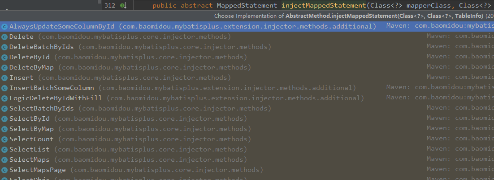

然后执行方法时，会自动执行该语句

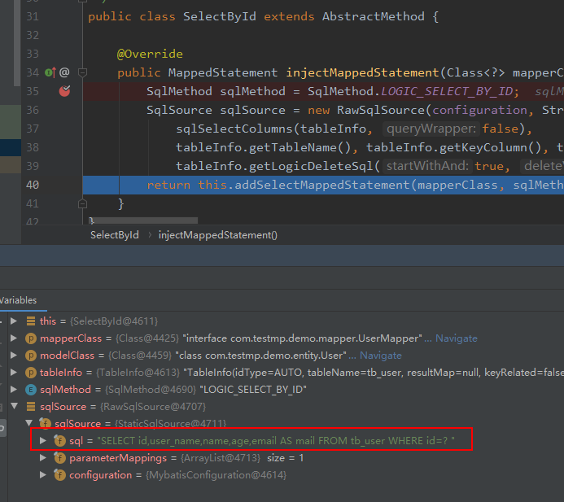

所以如果自己想自动注入sql的话，只需要模仿写一个方法，继承AbstractMethod 


## 7、自定义注入器

扩充baseMapper，增加一个findAll()方法，使得所有接口都具有该方法。

第一步：自定义一个接口，继承BaseMapper

```java
public interface MyBaseMapper<T> extends BaseMapper<T> {
    
    //自定义扩展方法
    List<T> findAll();
}
```

第二步：自定义一个方法类，继承AbstractMethod类，自定义通用sql语句

```java
public class FindAll extends AbstractMethod {

    @Override
    public MappedStatement injectMappedStatement(Class<?> mapperClass, Class<?> modelClass, TableInfo tableInfo) {

        String sql = "select * from " + tableInfo.getTableName();

        /**
         * 第一个参数：configuration 默认
         * 第二个参数：自定义sql语句   主要是写这个
         * 第三个参数：入参的 modelClass 默认
         */
        SqlSource sqlSource = languageDriver.createSqlSource(configuration, sql, modelClass);

        /**
         * sqlMethod.getMethod()  接口名 ，就是FindAll
         * sqlSource就是sql语句
         */
        return addSelectMappedStatement(mapperClass, "findAll", sqlSource, modelClass, tableInfo);
    }
}
```

第三步：自定义一个类，继承DefaultSqlInjector，而不是继承AbstractSqlInjector，这样就可以获取所有的原来的方法。

```java
public class MySqlInjector extends DefaultSqlInjector {
    @Override
    public List<AbstractMethod> getMethodList() {

        List<AbstractMethod> list = new ArrayList<>();
        
        //获取父类的所有方法
        list.addAll(super.getMethodList());
        //将自己的方法注入进去
        list.add(new FindAll());

        return list;
    }
}
```

第四步：将自定义注入器加入容器中

```java
    /**
     * 自定义注入器
     * @return
     */
    @Bean
    public MySqlInjector mySqlInjector(){
        return new MySqlInjector();
    }
```

第五步：将原来的接口，从继承BaseMapper改到继承MyBaseMapper

```java
public interface UserMapper extends MyBaseMapper<User> {

}
```

第六步：测试

```java
@Test
public void testFindAll(){
    List<User> list = userMapper.findAll();
    list.forEach(System.out::println);
}
```

结果：

```java
==>  Preparing: select * from tb_user 
==> Parameters: 
<==    Columns: id, user_name, password, name, age, email, version, deleted
<==        Row: 1, zhangsan, 123456, 张三, 18, test1@qq.cn, 1, 1
<==        Row: 2, lisi, 123456, 李四, 20, test2@qq.cn, 1, 1
<==        Row: 3, wangwu, 123456, 王五, 28, test3@qq.cn, 1, 1
<==        Row: 4, zhaoliu, 123456, 赵六, 21, test4@qq.cn, 1, 1
<==        Row: 5, sunqi, 123456, 孙七, 24, test5@qq.cn, 1, 1
<==      Total: 5
```


## 8、开启AR之旅

我查我自己，我插我自己，我删我自己。

在MP中，开启AR非常简单，只需要将实体对象继承Model即可。

```java
@Data
@NoArgsConstructor
@AllArgsConstructor
@TableName("tb_user")
public class User extends Model<User> {

    @TableId(type = IdType.AUTO)  //指定id类型为自增长
    private Long id;
    private String userName;
    @TableField(select = false)
    private String password;
    private String name;
    private Integer age;

    @TableField(value = "email")
    private String mail;

    @TableField(exist = false)    //该字段在数据库表中不存在
    private String address;
}
```

测试：

```java
@Test
public void test(){

    User user = new User();
    user.setId(1L);

    User entity = user.selectById(user);
    System.out.println("entity = " + entity);

}
```

结果：

```java
==>  Preparing: SELECT id,user_name,name,age,email AS mail FROM tb_user WHERE id=? 
==> Parameters: 1(Long)
<==    Columns: id, user_name, name, age, mail
<==        Row: 1, zhangsan, 张三, 18, test1@qq.cn
<==      Total: 1
```

连mapper都不需要引入。


其他CRUD操作都是一样的。

不过我一般不怎么使用，感觉怪怪的。


## 9、代码生成器

1、导入依赖

```xml
<dependency>
    <groupId>com.baomidou</groupId>
    <artifactId>mybatis-plus-generator</artifactId>
    <version>3.1.1</version>
</dependency>
<dependency>
    <groupId>org.freemarker</groupId>
    <artifactId>freemarker</artifactId>
    <version>2.3.30</version>
</dependency>
```

2、编写生成文件

需要修改的地方：

- 包名
- 模块名
- 表前缀
- 数据源
- 作者信息
- 是否使用lombok

```java
import com.baomidou.mybatisplus.core.exceptions.MybatisPlusException;
import com.baomidou.mybatisplus.core.toolkit.StringPool;
import com.baomidou.mybatisplus.core.toolkit.StringUtils;
import com.baomidou.mybatisplus.generator.AutoGenerator;
import com.baomidou.mybatisplus.generator.InjectionConfig;
import com.baomidou.mybatisplus.generator.config.*;
import com.baomidou.mybatisplus.generator.config.po.TableInfo;
import com.baomidou.mybatisplus.generator.config.rules.NamingStrategy;
import com.baomidou.mybatisplus.generator.engine.FreemarkerTemplateEngine;

import java.util.ArrayList;
import java.util.List;
import java.util.Scanner;

public class MysqlGenerator {

    //设置包名：   com.mp.test
    private static String packageName = "com.example.mp.demo2";
    //设置统一模块名 (可为空) com.mp.test.modelName
    private static String modelName = "user";
    //表前缀（没有前缀时，置位空串）
    private static String tablePrefix = "tb_";
    //数据源
    private static String url = "jdbc:mysql://112.124.25.228:3306/mp?useUnicode=true&characterEncoding=utf8&autoReconnect=true&allowMultiQueries=true&useSSL=false";
    private static String driverName = "com.mysql.jdbc.Driver";
    private static String userName = "root";
    private static String passWord = "916096467@Zxc";
    //作者信息
    private static String author = "vivo Admin";
    //是否使用lombok
    private static boolean useLombok = true;
    //是否使用AR模式
    private static boolean useAR = false;


    /**
     * RUN THIS
     * @param args
     */
    public static void main(String[] args) {
        // 代码生成器
        AutoGenerator mpg = new AutoGenerator();

        // 全局配置
        GlobalConfig gc = new GlobalConfig();
        String projectPath = System.getProperty("user.dir");
        gc.setOutputDir(projectPath + "/src/main/java");
        gc.setAuthor(author);
        gc.setOpen(false);
        gc.setActiveRecord(useAR);
        mpg.setGlobalConfig(gc);

        // 数据源配置
        DataSourceConfig dsc = new DataSourceConfig();
        dsc.setUrl(url.trim());
        dsc.setDriverName(driverName.trim());
        dsc.setUsername(userName.trim());
        dsc.setPassword(passWord.trim());
        mpg.setDataSource(dsc);

        // 包配置
        PackageConfig pc = new PackageConfig();
        if ("".equals(modelName.trim())){
            pc.setModuleName(scanner("模块名"));
        }else {
            pc.setModuleName(modelName.trim());
        }
        pc.setParent(packageName.trim());
        mpg.setPackageInfo(pc);

        // 自定义配置
        InjectionConfig cfg = new InjectionConfig() {
            @Override
            public void initMap() {
                // to do nothing
            }
        };

        //设置xml映射文件
        List<FileOutConfig> focList = new ArrayList<>();
        focList.add(new FileOutConfig("/templates/mapper.xml.ftl") {
            @Override
            public String outputFile(TableInfo tableInfo) {
                // 自定义输入文件名称
                return projectPath + "/src/main/resources/mapper/" + pc.getModuleName() + "/" + tableInfo.getEntityName() + "Mapper" + StringPool.DOT_XML;
            }
        });
        cfg.setFileOutConfigList(focList);
        mpg.setCfg(cfg);
        mpg.setTemplate(new TemplateConfig().setXml(null));

        // 策略配置
        StrategyConfig strategy = new StrategyConfig();
        //下划线转驼峰命名
        strategy.setNaming(NamingStrategy.underline_to_camel);
        strategy.setColumnNaming(NamingStrategy.underline_to_camel);
        //配置继承的父类
        //strategy.setSuperEntityClass("com.baomidou.mybatisplus.samples.generator.common.BaseEntity");
  //strategy.setSuperControllerClass("com.baomidou.mybatisplus.samples.generator.common.BaseController");
        //是否启用Lombok注解
        strategy.setEntityLombokModel(useLombok);
        strategy.setInclude(scanner("表名"));
        strategy.setTablePrefix(tablePrefix.trim());
        //strategy.setSuperEntityColumns("id");
        strategy.setControllerMappingHyphenStyle(true);
        //strategy.setTablePrefix(pc.getModuleName() + "_");
        strategy.setNaming(NamingStrategy.underline_to_camel);
        strategy.setColumnNaming(NamingStrategy.underline_to_camel);
        mpg.setStrategy(strategy);
        // 选择 freemarker 引擎需要指定如下加，注意 pom 依赖必须有！
        mpg.setTemplateEngine(new FreemarkerTemplateEngine());
        mpg.execute();
    }

    /**
     * 读取控制台内容
     * @param tip
     * @return
     */
    public static String scanner(String tip) {
        Scanner scanner = new Scanner(System.in);
        StringBuilder help = new StringBuilder();
        help.append("请输入" + tip + "：");
        System.out.println(help.toString());
        if (scanner.hasNext()) {
            String ipt = scanner.next();
            if (StringUtils.isNotEmpty(ipt)) {
                return ipt;
            }
        }
        throw new MybatisPlusException("请输入正确的" + tip + "！");
    }

}
```

运行main方法，输入表名即可


## 10、执行分析插件

在MP中提供了对SQL执行的分析的插件，可用作阻断全表更新、删除的操作.

> 该插件仅适用于开发环境，不适用于生产环境。 

1. 配置阻断器

   ```java
   @Configuration
   @MapperScan("com.example.mp.demo.user.mapper")
   public class MpConfig {
   
       /**
        *  执行分析插件
        */
       @Bean
       //@Profile({"dev","test"})// 设置 dev test 环境开启
       public SqlExplainInterceptor sqlExplainInterceptor() {
           SqlExplainInterceptor sqlExplainInterceptor = new SqlExplainInterceptor();
           List<ISqlParser> sqlParserList = new ArrayList<>();
           // 攻击 SQL 阻断解析器、加入解析链
           sqlParserList.add(new BlockAttackSqlParser());
           sqlExplainInterceptor.setSqlParserList(sqlParserList);
           return sqlExplainInterceptor;
       }
   }
   ```

2. 测试：删除和更新全表

   ```java
       @Test
       public void testUpdateAll(){
           User user = new User();
           user.setAge(10);
           user.update(null);
       }
   
       @Test
       public void testDeleteAll(){
           new User().delete(null);
       }
   ```

3. 结果

   ```
   更新：
   ### Error updating database.  Cause: com.baomidou.mybatisplus.core.exceptions.MybatisPlusException: Prohibition of table update operation
   ### Cause: com.baomidou.mybatisplus.core.exceptions.MybatisPlusException: Prohibition of table update operation
   
   删除：
   org.apache.ibatis.exceptions.PersistenceException: 
   ### Error updating database.  Cause: com.baomidou.mybatisplus.core.exceptions.MybatisPlusException: Prohibition of full table deletion
   ### Cause: com.baomidou.mybatisplus.core.exceptions.MybatisPlusException: Prohibition of full table deletion
   ```

   

## 11、性能分析插件

性能分析拦截器，用于输出每条 SQL 语句及其执行时间，可以设置最大执行时间，超过时间会抛出异常。

> 该插件只用于开发环境，不建议生产环境使用。

1. 配置组件

   ```java
    /**
        * SQL执行效率插件
        */
       @Bean
      // @Profile({"dev","test"})// 设置 dev test 环境开启
       public PerformanceInterceptor performanceInterceptor() {
           PerformanceInterceptor interceptor = new PerformanceInterceptor();
           //设置执行最长时间，超过这个时间就报错  单位：毫秒
           //interceptor.setMaxTime(20);
           //分析sql语句是否格式化
           //interceptor.setFormat(true);
           return interceptor;
       }
   ```

2. 执行语句就会自动显示操作时间

   ```mysql
   ==>  Preparing: SELECT id,user_name,password,name,age,email,version,deleted FROM tb_user 
   ==> Parameters: 
   <==    Columns: id, user_name, password, name, age, email, version, deleted
   <==        Row: 1, zhangsan, 123456, 张三, 18, test1@qq.cn, 1, 1
   <==        Row: 2, lisi, 123456, 李四, 20, test2@qq.cn, 1, 1
   <==        Row: 3, wangwu, 123456, 王五, 28, test3@qq.cn, 1, 1
   <==        Row: 4, zhaoliu, 123456, 赵六, 21, test4@qq.cn, 1, 1
   <==        Row: 5, sunqi, 123456, 孙七, 24, test5@qq.cn, 1, 1
   <==      Total: 5
   
    Time：28 ms - ID：com.example.mp.demo.user.mapper.UserMapper.selectList
   Execute SQL：SELECT id,user_name,password,name,age,email,version,deleted FROM tb_user
   ```

3. 如果设置了最大时间和语句格式化

   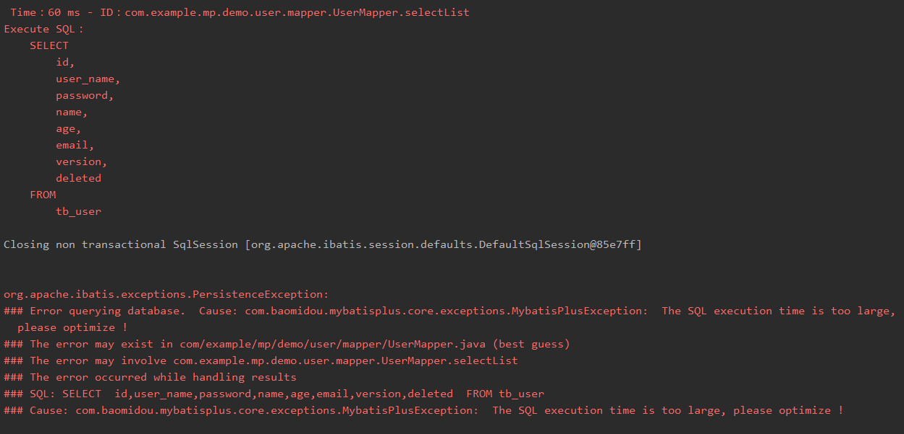

